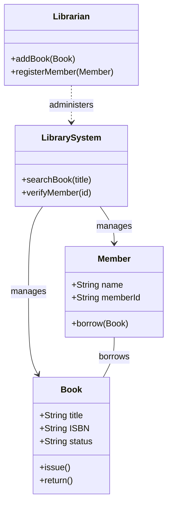
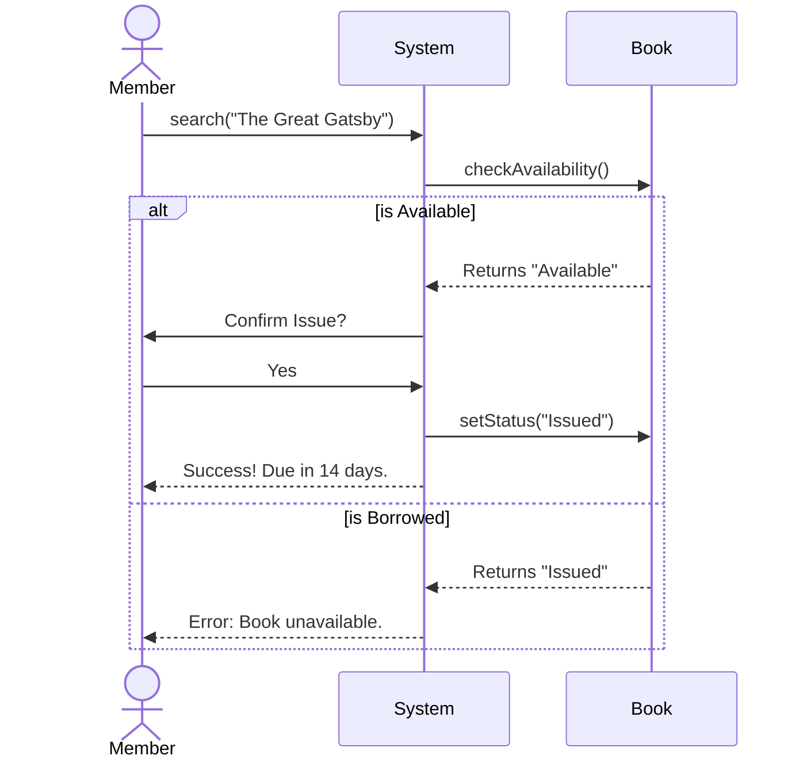
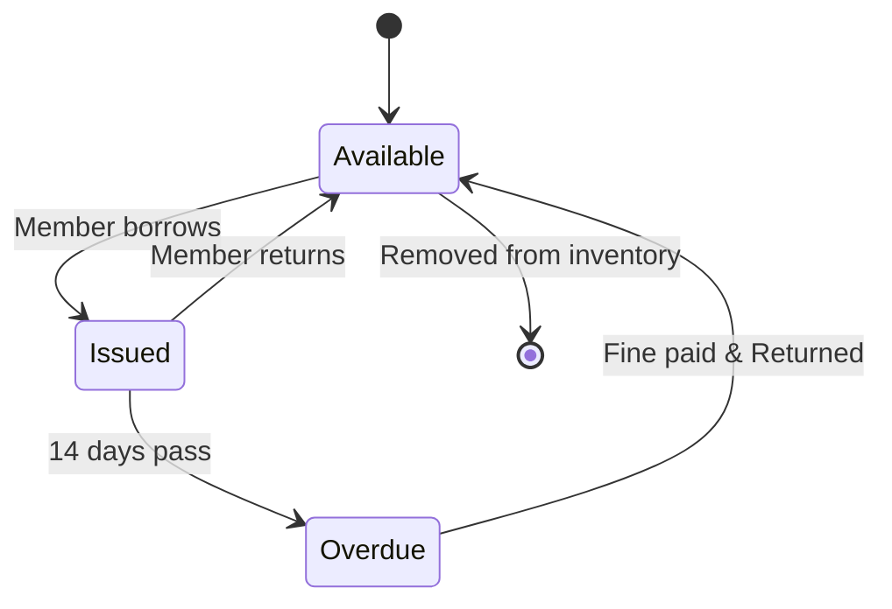

# Library Management System - Object-Oriented Analysis

## 1. Requirement Analysis

**Actors:**

- **Librarian (Admin):** Can add books, register members, and view all records.
- **Member (User):** Can search for books, borrow books, and return books.
- **System (Timer/Automated):** Checks for overdue books daily.

**Key Use Cases:**

- Login
- Search for Book
- Issue Book
- Return Book
- Add Book

## 2. System Architecture

The system follows a Layered Architecture to separate concerns:

1. **Presentation Layer:** The UI (Web/Mobile) that handles user interaction.
2. **Business Logic Layer:** Contains rules for borrowing limits, fines, and availability.
3. **Data Access Layer:** Connects to the database to fetch/save records.

## 3. OOA Diagrams

### Class Diagram

The structure of the system showing the relationships between the Library, Books, Members, and Librarians.

### Sequence Diagram

The flow of events when a member searches for and borrows a book.

### State Diagram

The lifecycle of a single book unit.

## 4. Implementation

The design logic and pseudocode for the class structures can be found in the [src folder](./src).
